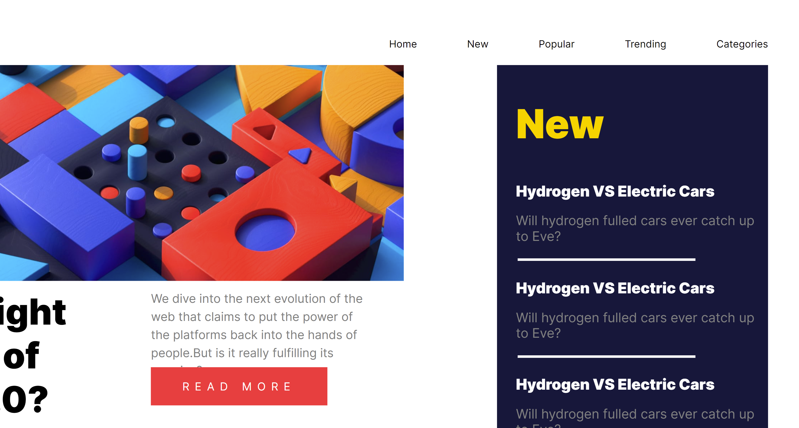

# 🎯 Frontend Mentor - News homepage solution

This is a solution to the [News homepage challenge on Frontend Mentor]
My Profile:
(https://www.frontendmentor.io/profile/RabicaTahir). 

### ♨Screenshot

### 🔗Links

- Solution URL: (https://github.com/RabicaTahir/ResponsivePage.github.io)
- Live Site URL: (https://rabicatahir.github.io/ResponsivePage.github.io/)

### 🎨🛠 Built with

- HTML5 
- CSS3 custom properties
- Flexbox
- CSS Grid
- Js (for logics)

## ✒Author

- Frontend Mentor - [@RabicaTahir](https://www.frontendmentor.io/profile/RabicaTahir)

## 📍📌Acknowledgments

Thank you frontendmentor for helping us developing and enhancing our skills <3.

